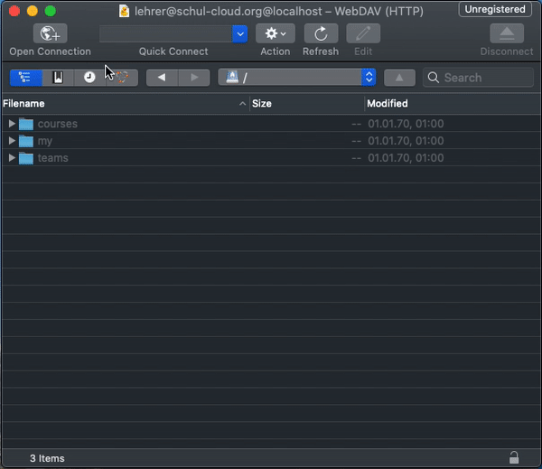

# webdav_experiment

## Installation
1. Clone Repository
1. Set `BASE_URL` in `.env` file
1. Run `npm install`
1. Run `npm run start`
1. Connect to `http://localhost:1900`

## TODO for MVP
- [x] Handle user auth
- [x] List users courses
- [x] List users directories in a course
- [x] List users files in a course
- [x] List subdirectories and files in a course
- [x] Open files in a course

## TODO for In App MVP

- [ ] Hide Feature behing Feature Flipper
- [ ] Move code to server (?)
- [ ] Documentation 
- [ ] Tests 

## More TODOs
- [ ] NextCloud / OwnCloud custom attributes
- [ ] NextCloud / OwnCloud server info
- [X] Handle Permissions
- [x] Handle available metadata
- [ ] Have updatetAt available on directories (must be done in SC Server)
- [X] Create Files
- [X] Create Dirs
- [x] Upload Files
- [x] Move Files 
- [x] Move Dir 
- [X] Delete Files
- [X] Delete Dir
- [ ] Write Files
- [ ] Populate Permissions directly on SC-server
- [ ] Handle teams data
- [ ] handle my files
- [ ] Handle shared files
- [ ] Add Dockerfile
- [ ] Make it work on OS X (currently the top level folders are shown as executables)
